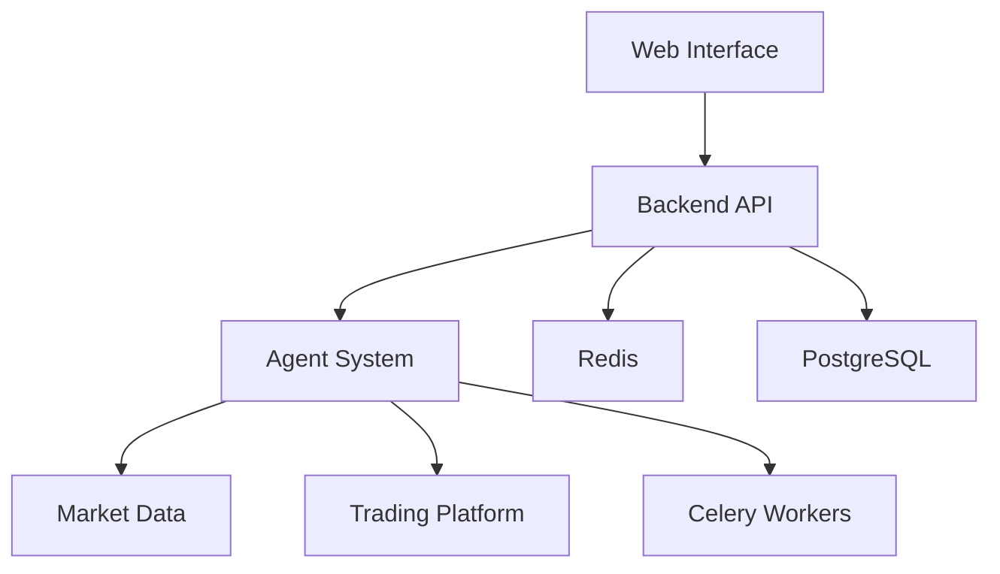

# Stock Trading Agent System

[](LICENSE)
[](SECURITY.md)
[](https://github.com/yourusername/stock-trading-agent/actions)

A sophisticated stock trading and analysis system powered by AI agents, providing real-time market analysis, automated trading strategies, and portfolio management.

## Table of Contents
- [Features](#features)
- [System Architecture](#system-architecture)
- [Security Best Practices](#security-best-practices)
- [Installation](#installation)
  - [Development Setup](#development-setup)
  - [Production Deployment](#production-deployment)
- [Configuration](#configuration)
- [API Documentation](#api-documentation)
- [Monitoring & Alerting](#monitoring--alerting)
- [Performance Optimization](#performance-optimization)
- [Troubleshooting](#troubleshooting)
- [Contributing](#contributing)
- [License](#license)
- [Smol Agents Project: A Comprehensive Report](#smol-agents-project-a-comprehensive-report)
  - [1. Introduction](#1-introduction)
  - [2. Project Architecture: A Deep Dive](#2-project-architecture-a-deep-dive)
    - [2.1. Backend (`app/`)](#21-backend-app)
    - [2.2. Custom Agents (`customagents/`)](#22-custom-agents-customagents)
    - [2.3. Web Interface (`web/`)](#23-web-interface-web)
  - [3. Project Workflow: A Granular Examination of Operations](#3-project-workflow-a-granular-examination-of-operations)
  - [4. Key Components and Technologies: An In-Depth Look](#4-key-components-and-technologies-an-in-depth-look)
  - [5. Code Flow Examples](#5-code-flow-examples)
  - [6. Security Considerations](#6-security-considerations)
  - [7. Future Enhancements](#7-future-enhancements)
  - [8. Conclusion](#8-conclusion)

## Features

- **Real-time Market Analysis**
  - Technical indicators (RSI, MACD, Bollinger Bands)
  - Fundamental analysis (P/E ratio, EPS, dividend yield)
  - Sentiment analysis from news and social media

- **Automated Trading**
  - AI-powered trading strategies
  - Risk management and position sizing
  - Backtesting capabilities

- **Portfolio Management**
  - Real-time portfolio tracking
  - Performance analytics
  - Risk assessment

- **Web Interface**
  - Interactive dashboards
  - Real-time notifications
  - Historical data visualization

## System Architecture



## Security Best Practices

### Environment Variables Management
- Use `.env` file for development
- Use secret management in production (AWS Secrets Manager, HashiCorp Vault)
- Never commit secrets to version control
- Rotate API keys regularly

### Secure Configuration
- Enable HTTPS for all services
- Use strong passwords for Redis and PostgreSQL
- Implement rate limiting
- Enable CORS with strict origin policy

### Monitoring
- Set up intrusion detection
- Monitor for suspicious activity
- Regular security audits

## Installation

### Development Setup

1. Clone the repository:
   ```bash
   git clone https://github.com/yourusername/stock-trading-agent.git
   cd stock-trading-agent
   ```

2. Set up environment variables:
   ```bash
   cp .env.example .env
   # Edit .env with your configuration
   ```

3. Build and run with Docker:
   ```bash
   docker-compose -f docker-compose.dev.yml up --build
   ```

4. Run database migrations:
   ```bash
   docker-compose exec web python manage.py migrate
   ```

5. Access services:
   - Web Interface: `http://localhost:8000`
   - API Docs: `http://localhost:8000/docs`
   - Redis Commander: `http://localhost:8081`

### Production Deployment

1. Set up production environment variables:
   ```bash
   cp .env.production.example .env
   # Configure production settings
   ```

2. Build production containers:
   ```bash
   docker-compose -f docker-compose.prod.yml build
   ```

3. Start services:
   ```bash
   docker-compose -f docker-compose.prod.yml up -d
   ```

4. Set up monitoring:
   ```bash
   docker-compose -f docker-compose.monitoring.yml up -d
   ```

## Configuration

### Key Environment Variables

| Variable               | Description                          | Default       | Required |
|------------------------|--------------------------------------|---------------|----------|
| `DEBUG`                | Enable debug mode                    | `False`       | No       |
| `SECRET_KEY`           | Django secret key                    |               | Yes      |
| `DATABASE_URL`         | PostgreSQL connection string         |               | Yes      |
| `REDIS_URL`            | Redis connection string              |               | Yes      |
| `API_KEY`              | Trading platform API key             |               | Yes      |
| `LOG_LEVEL`            | Logging level (DEBUG, INFO, WARN)    | `INFO`        | No       |
| `ALLOWED_HOSTS`        | Allowed hostnames                    | `*`           | No       |
| `CORS_ORIGIN_WHITELIST`| CORS allowed origins                 |               | No       |

## API Documentation

The system provides REST API endpoints documented using OpenAPI 3.0. Access the interactive documentation at `http://localhost:8000/docs`.

### Key Endpoints

| Endpoint               | Method | Description                     | Authentication |
|------------------------|--------|---------------------------------|----------------|
| `/api/analyze`         | POST   | Analyze stock data              | API Key        |
| `/api/trade`           | POST   | Execute trading strategy        | API Key        |
| `/api/portfolio`       | GET    | Get portfolio information       | API Key        |
| `/api/history`         | GET    | Get trading history             | API Key        |

## Monitoring & Alerting

The system includes built-in monitoring with:

- Prometheus for metrics collection
- Grafana for visualization
- Alertmanager for notifications

Access monitoring dashboards at `http://localhost:3000`

### Key Metrics Tracked
- API response times
- Error rates
- Resource utilization
- Trading activity

## Performance Optimization

### Caching Strategies
- Redis caching for frequent queries
- Database query optimization
- Connection pooling

### Scaling
- Horizontal scaling of Celery workers
- Load balancing for web services
- Database replication

## Troubleshooting

### Common Issues

**Database Connection Errors**
- Verify `DATABASE_URL` is correct
- Check PostgreSQL logs
- Ensure database is running

**Redis Connection Issues**
- Verify `REDIS_URL` is correct
- Check Redis logs
- Ensure Redis is running

**API Authentication Failures**
- Verify API key is correct
- Check request headers
- Validate token expiration

## Contributing

1. Fork the repository
2. Create your feature branch (`git checkout -b feature/AmazingFeature`)
3. Commit your changes (`git commit -m 'Add some AmazingFeature'`)
4. Push to the branch (`git push origin feature/AmazingFeature`)
5. Open a Pull Request

### Development Guidelines
- Follow PEP 8 style guide
- Write unit tests for new features
- Document all public interfaces
- Maintain backward compatibility

## License

This project is licensed under the MIT License - see the [LICENSE](LICENSE) file for details.

# Smol Agents Project: A Comprehensive Report

## 1. Introduction

The Smol Agents project is an ambitious endeavor to create an intelligent system for interacting with financial markets. It leverages the power of autonomous agents, artificial intelligence, and modern web technologies to provide users with capabilities for stock trading, market analysis, and portfolio management. This report provides a detailed exploration of the project's architecture, functionalities, workflow, and underlying technologies.

## 2. Project Architecture: A Deep Dive

The project adopts a modular and layered architecture, promoting maintainability and scalability. The core components are logically separated, facilitating independent development and testing.

### 2.1. Backend (`app/`)
The backend forms the core of the application, responsible for business logic, data processing, and agent orchestration. It's built using the Flask microframework.

### 2.2. Custom Agents (`customagents/`)
This directory is intended for custom agent implementations or extensions to the core agents. The structure and content would depend on specific user needs and extensions to the base functionality.

### 2.3. Web Interface (`web/`)
The `web/` directory implements the user interface of the application, built using the Django framework.

## 3. Project Workflow: A Granular Examination of Operations

The Smol Agents project meticulously orchestrates a sequence of steps to process user requests, capitalizing on its modular architecture and efficient asynchronous task management.

1. **User Interaction and API Request Initiation:** The process commences with a user engaging with the Smol Agents system. This interaction can manifest through the intuitive web interface, where users might interact with forms or dynamic elements to articulate their requests. Alternatively, more technically inclined users or external systems can directly interface with the application's API by dispatching HTTP requests. The primary gateway for initiating agent tasks is the `/agent/run` API endpoint, which anticipates a POST request encapsulating the user's query within a JSON payload.

2. **Request Handling and Asynchronous Task Creation (`app/routes/agent_routes.py`):** Upon the arrival of a request at the `/agent/run` endpoint, the robust Flask framework intelligently routes it to the designated `run_agent` function, residing within `app/routes/agent_routes.py`.

3. **Asynchronous Task Execution: Orchestration by Celery Workers (`app/tasks/stock_task.py`)**

At the core of the Smol Agents' asynchronous processing is Celery, a distributed task queue. Celery utilizes a pool of worker processes that actively monitor the configured message queue (Redis in this case) for new tasks.

4. **Result Handling and Status Updates: Providing Feedback to the User**

After the `StockAgent` diligently completes the assigned task, the `run_stock_agent_task` function takes responsibility for preparing a comprehensive result. This result can take various forms, depending on the nature of the task, and might include the real-time fetched stock price, a detailed confirmation of a successfully executed trade, an insightful analytical report, or, in cases where unforeseen issues arise, a descriptive error message.

5. **Example Workflow:**

Let's illustrate with the query: "Buy 1 share of AAPL at market price."

## 4. Key Components and Technologies: An In-Depth Look

- **Flask:** A lightweight and flexible py web framework that provides essential tools for building web applications and APIs. It handles routing, request processing, and response generation.
- **Celery:** A powerful asynchronous task queue that enables the execution of long-running or computationally intensive tasks outside of the main application thread. It uses message brokers like Redis or RabbitMQ to distribute tasks to worker processes.
- **Redis:** An in-memory data store that is used as a message broker for Celery and as a result backend for storing task results. Its speed and efficiency make it well-suited for these purposes.
- **Alpaca API:** A platform that provides an API for commission-free stock trading. The Smol Agents project uses this API to execute buy and sell orders, retrieve account information, and access market data.
- **yfinance:** A popular py library for accessing financial data from Yahoo Finance. It's used to retrieve stock prices, historical data, and other relevant market information.
- **Smol Agents Library:** The core framework upon which the intelligent agents are built. It provides base classes like `CodeAgent`, `ToolCallingAgent`, and `ManagedAgent`, which offer structure and functionality for creating autonomous agents with access to tools.
- **LiteLLM:** A library that provides a consistent interface for interacting with various large language models (LLMs). This allows the project to leverage the power of LLMs for natural language understanding and task planning.
- **DeepSeek Coder Model:** A specific large language model that is particularly adept at code generation and reasoning. It's likely used by the `manager` agent to understand user queries and plan how to use the available tools.
- **DuckDuckGo Search Tool & Visit Webpage Tool:** These tools, often used in conjunction, enable the `web_agent` to gather information from the internet. The `DuckDuckGoSearchTool` performs searches, and the `VisitWebpageTool` retrieves the content of web pages.

## 5. Code Flow Examples

Consider a user query: "Buy 1 share of AAPL at market price."

1. **API Request:** The user sends a POST request to the `/agent/run` endpoint with the JSON payload `{"query": "Buy 1 share of AAPL at market price"}`.

2. **Request Handling (`app/routes/agent_routes.py`):**
    *   The `run_agent` function receives the request.
    *   It extracts the query: `"Buy 1 share of AAPL at market price"`.
    *   It initiates the Celery task: `run_stock_agent_task.apply_async(args=["Buy 1 share of AAPL at market price"])`.
    *   A task ID (e.g., `af3c4d7a-1b2b-4b3a-9c1d-0e9a8f7c6b5e`) is generated.
    *   The API returns a response: `{"task_id": "af3c4d7a-1b2b-4b3a-9c1d-0e9a8f7c6b5e"}`.

3. **Task Execution (`app/tasks/stock_task.py`):**
    *   A Celery worker picks up the `run_stock_agent_task`.
    *   An instance of `StockAgent` is created.
    *   The `StockAgent`'s `run` method is called with the query.
    *   The `manager` agent within `StockAgent` analyzes the query and determines the need for the `MarketOrderTool`.
    *   The `manager` instructs the `trader` agent to use the `MarketOrderTool`.

4. **Tool Execution (`app/tools/trade.py`):**
    *   The `MarketOrderTool` is executed with parameters like `symbol='AAPL'`, `qty=1`, `side='buy'`, `type='market'`.
    *   The `MarketOrderTool` interacts with the Alpaca API using the Alpaca SDK.
    *   The Alpaca API receives the order request.
    *   If the order is successful, the Alpaca API returns order details (e.g., order ID, filled quantity, fill price).
    *   If there's an error (e.g., insufficient funds), the Alpaca API returns an error message.

5. **Result Handling (`app/tasks/stock_task.py`):**
    *   The `MarketOrderTool` returns the Alpaca API response.
    *   The `trader` agent passes this back to the `manager`.
    *   The `manager` formats the result.
    *   The `run_stock_agent_task` function returns a result like `{"query": "Buy 1 share of AAPL at market price", "result": {"order_id": "...", "status": "filled", ...}}` or an error message.

6. **Status Retrieval (`app/routes/agent_routes.py`):**
    *   The user can check the status by sending a GET request to `/agent/status/af3c4d7a-1b2b-4b3a-9c1d-0e9a8f7c6b5e`.
    *   The `agent_status` function retrieves the task status and result from the Celery backend (Redis).
    *   The API returns the task status and result to the user.

## 6. Security Considerations

Security is paramount in a financial application like Smol Agents. Key considerations include:

*   **API Key Management:** Securely storing and accessing Alpaca API keys is crucial. Environment variables or dedicated secret management tools should be used.
*   **Input Validation:** Thoroughly validating user inputs to prevent injection attacks and other vulnerabilities.
*   **Authentication and Authorization:** Implementing robust authentication mechanisms to verify user identity and authorization to control access to sensitive functionalities.
*   **Data Encryption:** Encrypting sensitive data both in transit (using HTTPS) and at rest.
*   **Rate Limiting:** Implementing rate limits to prevent abuse of the API and protect against denial-of-service attacks.
*   **Regular Security Audits:** Conducting regular security assessments and penetration testing to identify and address potential vulnerabilities.

## 7. Future Enhancements

*   **More Sophisticated Agents:** Developing more specialized agents for different trading strategies or asset classes.
*   **Advanced Risk Management:** Implementing features for setting stop-loss orders, take-profit levels, and other risk management tools.
*   **Portfolio Tracking and Analysis:** Adding functionalities for users to track their portfolio performance and analyze their trading history.
*   **Integration with More Data Sources:** Incorporating data from additional financial data providers.
*   **User Interface Improvements:** Enhancing the web interface with more interactive charts, real-time data, and user-friendly controls.
*   **Machine Learning Enhancements:** Continuously improving the stock prediction models with more data and advanced techniques.

## 8. Conclusion

The Smol Agents project is a sophisticated and well-engineered system for autonomous stock trading and analysis. Its modular architecture, asynchronous task processing, and intelligent agent design demonstrate a strong foundation for building advanced financial applications. The detailed workflow and the integration of various powerful technologies highlight the project's potential and complexity. Further development and refinement could lead to a highly valuable tool for both novice and experienced investors.
