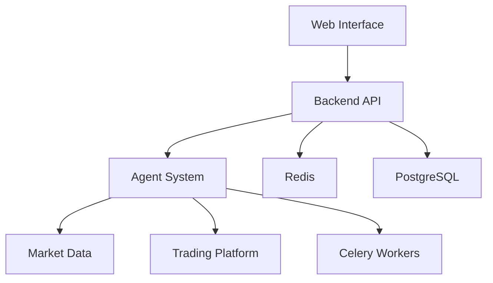

# Stock Trading Agent System

[](LICENSE)
[](SECURITY.md)
[](https://github.com/yourusername/stock-trading-agent/actions)

A sophisticated stock trading and analysis system powered by AI agents, providing real-time market analysis, automated trading strategies, and portfolio management.

## Table of Contents
- [Features](#features)
- [System Architecture](#system-architecture)
- [Security Best Practices](#security-best-practices)
- [Installation](#installation)
  - [Development Setup](#development-setup)
  - [Production Deployment](#production-deployment)
- [Configuration](#configuration)
- [API Documentation](#api-documentation)
- [Monitoring & Alerting](#monitoring--alerting)
- [Performance Optimization](#performance-optimization)
- [Troubleshooting](#troubleshooting)
- [Contributing](#contributing)
- [License](#license)

## Features

- **Real-time Market Analysis**
  - Technical indicators (RSI, MACD, Bollinger Bands)
  - Fundamental analysis (P/E ratio, EPS, dividend yield)
  - Sentiment analysis from news and social media

- **Automated Trading**
  - AI-powered trading strategies
  - Risk management and position sizing
  - Backtesting capabilities

- **Portfolio Management**
  - Real-time portfolio tracking
  - Performance analytics
  - Risk assessment

- **Web Interface**
  - Interactive dashboards
  - Real-time notifications
  - Historical data visualization

## System Architecture



## Security Best Practices

### Environment Variables Management
- Use `.env` file for development
- Use secret management in production (AWS Secrets Manager, HashiCorp Vault)
- Never commit secrets to version control
- Rotate API keys regularly

### Secure Configuration
- Enable HTTPS for all services
- Use strong passwords for Redis and PostgreSQL
- Implement rate limiting
- Enable CORS with strict origin policy

### Monitoring
- Set up intrusion detection
- Monitor for suspicious activity
- Regular security audits

## Installation

### Development Setup

1. Clone the repository:
   ```bash
   git clone https://github.com/yourusername/stock-trading-agent.git
   cd stock-trading-agent
   ```

2. Set up environment variables:
   ```bash
   cp .env.example .env
   # Edit .env with your configuration
   ```

3. Build and run with Docker:
   ```bash
   docker-compose -f docker-compose.dev.yml up --build
   ```

4. Run database migrations:
   ```bash
   docker-compose exec web python manage.py migrate
   ```

5. Access services:
   - Web Interface: `http://localhost:8000`
   - API Docs: `http://localhost:8000/docs`
   - Redis Commander: `http://localhost:8081`

### Production Deployment

1. Set up production environment variables:
   ```bash
   cp .env.production.example .env
   # Configure production settings
   ```

2. Build production containers:
   ```bash
   docker-compose -f docker-compose.prod.yml build
   ```

3. Start services:
   ```bash
   docker-compose -f docker-compose.prod.yml up -d
   ```

4. Set up monitoring:
   ```bash
   docker-compose -f docker-compose.monitoring.yml up -d
   ```

## Configuration

### Key Environment Variables

| Variable               | Description                          | Default       | Required |
|------------------------|--------------------------------------|---------------|----------|
| `DEBUG`                | Enable debug mode                    | `False`       | No       |
| `SECRET_KEY`           | Django secret key                    |               | Yes      |
| `DATABASE_URL`         | PostgreSQL connection string         |               | Yes      |
| `REDIS_URL`            | Redis connection string              |               | Yes      |
| `API_KEY`              | Trading platform API key             |               | Yes      |
| `LOG_LEVEL`            | Logging level (DEBUG, INFO, WARN)    | `INFO`        | No       |
| `ALLOWED_HOSTS`        | Allowed hostnames                    | `*`           | No       |
| `CORS_ORIGIN_WHITELIST`| CORS allowed origins                 |               | No       |

## API Documentation

The system provides REST API endpoints documented using OpenAPI 3.0. Access the interactive documentation at `http://localhost:8000/docs`.

### Key Endpoints

| Endpoint               | Method | Description                     | Authentication |
|------------------------|--------|---------------------------------|----------------|
| `/api/analyze`         | POST   | Analyze stock data              | API Key        |
| `/api/trade`           | POST   | Execute trading strategy        | API Key        |
| `/api/portfolio`       | GET    | Get portfolio information       | API Key        |
| `/api/history`         | GET    | Get trading history             | API Key        |

## Monitoring & Alerting

The system includes built-in monitoring with:

- Prometheus for metrics collection
- Grafana for visualization
- Alertmanager for notifications

Access monitoring dashboards at `http://localhost:3000`

### Key Metrics Tracked
- API response times
- Error rates
- Resource utilization
- Trading activity

## Performance Optimization

### Caching Strategies
- Redis caching for frequent queries
- Database query optimization
- Connection pooling

### Scaling
- Horizontal scaling of Celery workers
- Load balancing for web services
- Database replication

## Troubleshooting

### Common Issues

**Database Connection Errors**
- Verify `DATABASE_URL` is correct
- Check PostgreSQL logs
- Ensure database is running

**Redis Connection Issues**
- Verify `REDIS_URL` is correct
- Check Redis logs
- Ensure Redis is running

**API Authentication Failures**
- Verify API key is correct
- Check request headers
- Validate token expiration

## Contributing

1. Fork the repository
2. Create your feature branch (`git checkout -b feature/AmazingFeature`)
3. Commit your changes (`git commit -m 'Add some AmazingFeature'`)
4. Push to the branch (`git push origin feature/AmazingFeature`)
5. Open a Pull Request

### Development Guidelines
- Follow PEP 8 style guide
- Write unit tests for new features
- Document all public interfaces
- Maintain backward compatibility

## License

This project is licensed under the MIT License - see the [LICENSE](LICENSE) file for details.
